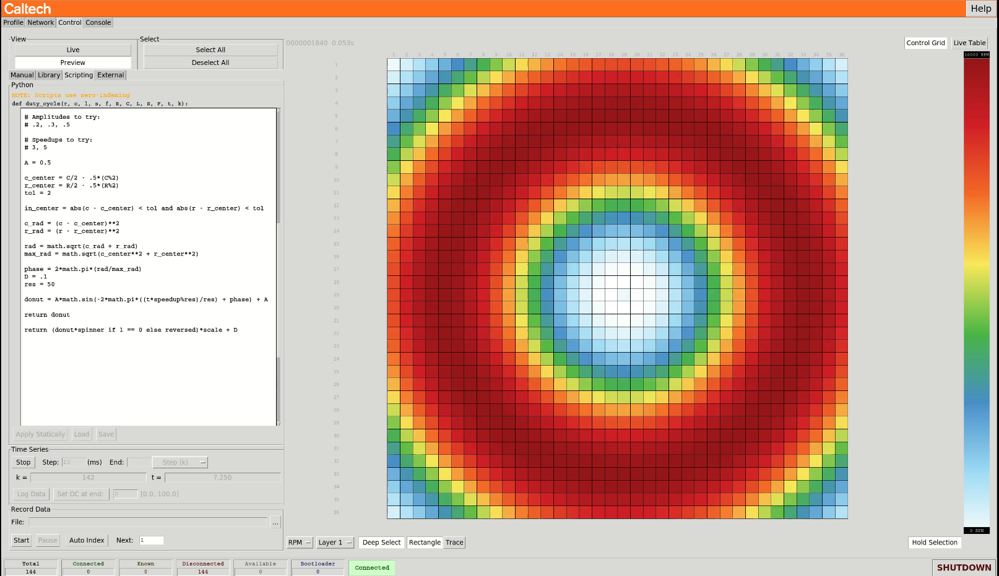

# Fan Club MkIV

Alejandro A. Stefan-Zavala `aastefan@caltech.edu`

We're in the process of open-sourcing this repository, which has been in development since 2017 within GALCIT, at Caltech. ==This documentation is incomplete.==

## Quickstart [incomplete]

Here I refer to the front-end script you run on your computer as "master" (`master/main.py`) and the microcontrollers that directly interact with fans as "boards."

Specific fan arrays (which microcontrollers, connected in what way, running what fans, etc.) are represented as "profiles." You can switch between existing profiles in the **Profiles** tab on the top-right of the master GUI. In this tab, on the top-right there is an option to switch profiles.

You can set which of the existing profiles is loaded on startup by setting the `INIT_PROFILE`  variable defined at the start of `master/main.py`. 

To create a new profile, define it as a dictionary in `master/fc/builtin/profiles.py` and add this dictionary to the `PROFILES` dictionary defined at the very end of that file. Choosing a profile in the GUI amounts to specifying a string to query off that `PROFILES` dictionary. You may copy, rename and modify of the existing profiles to create your own.

The most important information you'll need to set up a profile is the MAC addresses of the boards to control and the IP address to which to broadcast the connection message. See below.

#### Flash microcontrollers

This version only supports **NUCLEO F429ZI** boards. NUCLEO F439ZI boards appear to work too, but have not been tested. There's a pre-compiled binary in `master/FC_MkIV_binaries.zip`. Flash the file `Slave.bin` within that archive in your boards.

> You may probe the state of the microcontrollers, including connection to the network, IP and MAC address, and messages received from master, over serial using baud rate 460800 (USB port next to the Ethernet port on F429ZI)

#### Connect network

Connect master computer and all slave boards in the same network. Connecting all devices to the same router over ethernet is most reliable. You will need the MAC and IP addresses of the boards, which you can obtain from the Master software. 

Start the master software by executing `master/main.py`

In the **Network** tab, you can monitor the network of boards in your fan array. Set the "Broadcast IP" field to the router's Gateway IP address ending in `255`. For example, if your router sets all local IP address to `192.168.0.XXX`, set the Broadcast IP to `192.168.0.255`. The master will now broadcast a message on this network that the boards will use to connect. Ensure no router or OS firewalls are blocking this operation.

Boards should appear in the field on the bottom.

Use these MAC addresses to add the boards to your new profile.

[IOU]

## Dependencies

The master side of the software is written entirely in Python 3. The only package not built into Python 3 is `numpy`. Future versions will remove this requirement. It can run on Linux, macOS and Windows. It has been most thoroughly tested and is most reliable in Ubuntu, followed by Windows 10 and last macOS.

